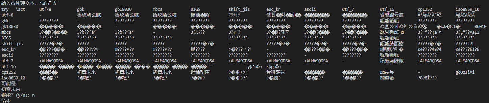

# Messy-code-recovery

Messy code recovery. Try to encode and decode in utf-8, gbk, BIG5, euc_kr and much more

中文版请看 [README-CN.md](./README-CN.md)

## usage

It is a command line tool. You can use it like this:

```bash
$ python main.py 
    输入待处理文本: {your text}
```

## example

```bash
python main.py 
```



## inspiration

It was made for an online TRPG game. In that game, the DM hide some information encode the information in one encoding and decode in another encoding, so the players can't get the information. So I made this tool to recover the information.

By the way, This game is wonderful. If you are interested in it, you can find it in [here](https://www.nmbxd1.com/t/52010487). The DM is currently very busy, so you may need to wait for a while.

Inspired by [乱码恢复](http://www.mytju.com/classcode/tools/messyCodeRecover.asp), and developed based on [MojibakeRecover](https://github.com/Dreace/MojibakeRecover).
